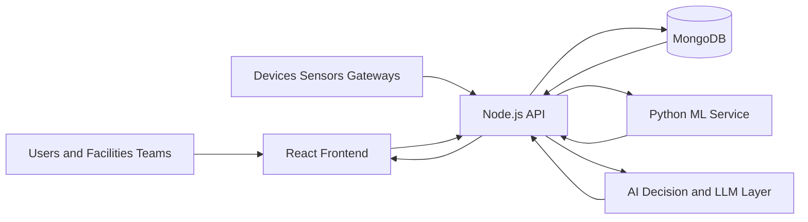

# SustainOS AI


SustainOS AI is a full-stack sustainability operations platform for smart buildings, campuses, enterprises, and public infrastructure. It turns raw water and energy telemetry into alerts, AI explanations, forecasts, incident queues, and an execution-focused Mission Control dashboard so teams can reduce waste instead of just watching charts.

For judges and reviewers using the deployed app, start with [JUDGE_GUIDE.md](JUDGE_GUIDE.md).

## flowchart LR
  A[User / Sensors] --> B[React Frontend]
  B --> C[Node.js API]
  C --> D[(MongoDB)]
  C --> E[Python ML Service]
  C --> F[AI Layer]
  C --> B
  
## Tagline

From raw building telemetry to operational decisions.

## Problem

Water and energy waste usually stays hidden because operations teams deal with scattered dashboards, delayed reporting, and reactive maintenance. In campuses, hostels, hospitals, offices, and public buildings, this leads to:

- unnoticed leakage and abnormal utility spikes
- delayed incident response
- poor visibility into sensor health
- weak accountability across teams
- hard-to-explain sustainability data for decision makers

## Solution

SustainOS AI combines telemetry ingestion, analytics, AI guidance, ML forecasting, and SaaS workspace controls into one operational product. Teams can ingest data from users, devices, gateways, or webhooks, detect anomalies, prioritize hotspots, assign action, and track workspace-level activity from a single system.

## What The Product Does

- Ingests water and energy telemetry through manual entry, sensors, gateways, and webhook-style APIs
- Detects abnormal spikes, likely leakage, peak-load drift, and sensor reliability issues
- Generates alerts, notifications, and incident-ready operational context
- Calculates sustainability score, usage summaries, and efficiency trends
- Forecasts near-term usage with a Python ML microservice
- Provides natural-language AI explanations and guided next actions
- Ranks hotspots in a Mission Control dashboard with savings and risk context
- Tracks sensors, low-battery devices, weak signal quality, and telemetry health
- Supports workspace-level SaaS operations with roles, invites, plans, API keys, and audit logs

## Why It Matters

SustainOS AI is designed for real-world operators, not just analysts.

Primary use cases:

- smart campuses and universities
- hostels and residential blocks
- hospitals and healthcare facilities
- corporate offices and commercial buildings
- smart city and municipal monitoring pilots
- sustainability consulting and operations command centers

## Hackathon Pitch

SustainOS AI is a sustainability operations SaaS platform that helps organizations detect utility waste, prioritize incidents, and act faster using AI and real-time telemetry. Instead of only showing dashboards, it tells teams what is wrong, where it is happening, and what to do next.

## Product Highlights

### 1. Mission Control

The Mission Control layer ranks buildings by risk and opportunity, then translates telemetry into an execution plan.

- hotspot ranking
- issue classification
- savings opportunity
- carbon and water recovery estimation
- team-level queueing
- execution roadmap for today, this week, and this month

### 2. AI Copilot

The AI layer helps users understand the state of operations in natural language.

- contextual Q and A
- forecast explanation
- live-data-aware responses
- fallback logic when external LLMs are unavailable
- support for local Ollama and optional OpenAI or Gemini

### 3. SaaS Workspace

The platform includes a real SaaS-style operational layer.

- workspace profile
- owner, admin, operator, analyst, and viewer roles
- invite-based team onboarding
- plan-aware workspace controls
- API key creation and revocation
- audit trail for critical actions

### 4. Sensor and IoT Operations

- sensor registration and heartbeat tracking
- API key-based ingest for devices and gateways
- low battery and weak signal detection
- sensor summary and telemetry confidence view

### 5. Reliability and Runtime Health

- backend liveness and readiness endpoints
- structured error handling
- request-scoped trace IDs
- frontend error boundary
- smoke test scripts for deployment and demo validation

## End-To-End Flow

1. A user creates an account or joins a workspace through an invite.
2. The workspace owner configures organization details, plan, roles, and API access.
3. Telemetry is sent through manual input, sensor endpoints, or gateway/webhook APIs.
4. The backend stores the data in MongoDB and syncs sensor heartbeat information.
5. Detection logic evaluates spikes, drift, and anomaly patterns.
6. Alerts and notifications are generated when a risk threshold is crossed.
7. Analytics and score engines summarize operational health.
8. The Python ML service predicts future usage and supports advanced insight generation.
9. Mission Control prioritizes hotspots and recommends next actions.
10. The AI copilot explains what is happening in natural language.

## Architecture



### Frontend

- React 19
- Vite 7
- Tailwind CSS
- Recharts and Chart.js
- Socket.IO client
- Role-aware protected routes

Core views:

- Dashboard
- Analytics
- Recommendations / Mission Control
- Alerts
- Incidents
- Sensors
- Workspace
- Reports
- Notifications
- Profile and Settings

### Backend

- Node.js
- Express 5
- Mongoose
- Socket.IO
- JWT authentication
- API key authentication for machine ingest

Key API areas:

- auth
- telemetry
- analytics
- alerts
- sensors
- notifications
- AI
- workspace / platform

### ML Service

- Python HTTP service
- anomaly support
- forecasting
- model training
- profile voice parsing

### Data Models

- User
- Data
- Alert
- Notification
- SensorDevice
- ApiKey
- AuditLog
- WorkspaceInvite
- ConversationMemory
- UserSettings

## Repository Structure

```text
SustainOS Ai/
|-- Client/
|   |-- src/
|   |   |-- components/
|   |   |-- context/
|   |   |-- pages/
|   |   |-- routes/
|   |   `-- utils/
|   |-- package.json
|   `-- vite.config.js
|-- server/
|   |-- ai/
|   |-- config/
|   |-- controllers/
|   |-- middleware/
|   |-- models/
|   |-- routes/
|   |-- services/
|   |-- tests/
|   |-- app.js
|   `-- server.js
|-- ml_service/
|   |-- server.py
|   |-- trainable_model.py
|   |-- profile_voice_model.py
|   |-- requirements.txt
|   `-- .env.example
|-- screenshots/
|-- start-dev.ps1
|-- hackathon-smoke-test.ps1
|-- full-e2e-demo.ps1
|-- DEPLOYMENT.md
|-- render.yaml
|-- README.md
`-- LICENSE
```

## Tech Stack

- Frontend: React, Vite, Tailwind CSS, Recharts, Chart.js, Framer Motion
- Backend: Node.js, Express, Mongoose, Socket.IO, JWT
- Database: MongoDB
- ML: Python service
- AI Providers: Ollama by default, optional OpenAI and Gemini
- Deployment: Render-ready backend and ML blueprint, static frontend compatible

## Demo

### Live Deployment

Current Render service dashboard links:

- `Frontend Service (Render Dashboard)`: `https://dashboard.render.com/static/srv-d71tiqm3jp1c739ijndg`
- `Backend Service (Render Dashboard)`: `https://dashboard.render.com/web/srv-d71td6v5gffc73839o7g`
- `ML Service (Render Dashboard)`: `https://dashboard.render.com/web/srv-d71u7nlm5p6s73a1od60`

Note:

- These are Render dashboard and service-management links.
- Judges should not use these links directly.
- Replace these with the deployed public domain URLs from Render in [JUDGE_GUIDE.md](JUDGE_GUIDE.md) before submission.

### Demo Video

Add your final demo link here:

- `Demo Video`: `PASTE_YOUR_DEMO_VIDEO_LINK_HERE`

Suggested demo flow:

1. Start with the dashboard and problem statement
2. Show live alerts and Mission Control
3. Open Workspace to show SaaS product depth
4. Show Sensors and API-key-based ingestion
5. Show Analytics, ML prediction, and AI copilot
6. End with impact, savings, and real-world use cases

### Built-In Demo Validation

This repo includes two scripts to help with judging and demo prep:

- `hackathon-smoke-test.ps1`
  Verifies frontend, backend, and ML health endpoints.
- `full-e2e-demo.ps1`
  Creates a fresh workspace, seeds realistic telemetry, triggers alerts, trains the ML model, and verifies core APIs end to end.

Example:

```powershell
.\hackathon-smoke-test.ps1 -FrontendUrl http://127.0.0.1:4173 -BackendUrl http://127.0.0.1:5000 -MlUrl http://127.0.0.1:8000
```

```powershell
.\full-e2e-demo.ps1 -FrontendUrl http://127.0.0.1:4173 -BackendUrl http://127.0.0.1:5000 -MlUrl http://127.0.0.1:8000
```

What the seeded demo validates:

- account registration
- workspace profile update
- team invite creation
- API key generation
- sensor registration
- telemetry ingest
- analytics and score
- Mission Control hotspot ranking
- alerts and notifications
- ML training and prediction
- AI forecast and Q and A

## Screenshots

Add your screenshots inside the `screenshots/` folder using these names.

| Section | Suggested filename | What to capture |
| --- | --- | --- |
| Landing or Login | `screenshots/01-login-or-landing.png` | clean hero or auth entry screen |
| Dashboard | `screenshots/02-dashboard-overview.png` | KPI cards, latest telemetry, live stats |
| Analytics | `screenshots/03-analytics-overview.png` | charts, score, executive insights |
| Mission Control | `screenshots/04-mission-control.png` | hotspot ranking, roadmap, savings |
| Alerts | `screenshots/05-alerts-queue.png` | open alerts, severity, actions |
| Incidents | `screenshots/06-incidents-workflow.png` | status changes and operational queue |
| Sensors | `screenshots/07-sensors-health.png` | sensor list, health, low battery or weak signal |
| Workspace | `screenshots/08-workspace-console.png` | roles, plan, API keys, audit, invites |
| AI Copilot | `screenshots/09-ai-copilot.png` | AI answer with operational reasoning |
| Reports | `screenshots/10-reports-export.png` | report generation or downloadable summary |
| Mobile View | `screenshots/11-mobile-dashboard.png` | responsive dashboard or Mission Control |
| End-to-End Demo | `screenshots/12-seeded-demo-proof.png` | proof of seeded telemetry and alerts |

## Local Setup

### Prerequisites

- Node.js `20.19+`
- Python `3.10+`
- MongoDB connection string
- Optional Ollama for local AI mode

### 1. Clone and install

```powershell
git clone <your-repo-url>
cd "SustainOS Ai"

cd server
npm install

cd ..\Client
npm install

cd ..\ml_service
pip install -r requirements.txt

cd ..
```

### 2. Configure environment files

Copy these files and fill values:

- `server/.env.example`
- `Client/.env.example`
- `ml_service/.env.example`

Recommended local values:

```env
# server/.env
NODE_ENV=development
MONGO_URI=your_mongodb_connection_string
PORT=5000
JWT_SECRET=your_jwt_secret
CLIENT_ORIGIN=http://localhost:5173
AI_PROVIDER=ollama
OLLAMA_URL=http://localhost:11434/api/chat
OLLAMA_MODEL=llama3.2:1b
ML_SERVICE_URL=http://localhost:8000
```

```env
# Client/.env
VITE_API_URL=http://localhost:5000
VITE_SOCKET_URL=http://localhost:5000
```

```env
# ml_service/.env
HOST=0.0.0.0
PORT=8000
```

### 3. Start the stack

Start all services manually:

```powershell
python ml_service/server.py
```

```powershell
cd server
npm run dev
```

```powershell
cd Client
npm run dev
```

Or use the helper:

```powershell
.\start-dev.ps1
```

### 4. Optional local AI mode

```powershell
ollama pull llama3.2:1b
ollama serve
```

If you do not want external providers during hackathon judging, keep:

- `OPENAI_API_KEY=` empty
- `GEMINI_API_KEY=` empty
- `AI_PROVIDER=ollama` or use the local fallback mode

## Deployment

This repository includes a Render blueprint in `render.yaml`.

Services:

- `sustainos-api`
- `sustainos-ml`

Current Render dashboard links:

- Frontend dashboard: `https://dashboard.render.com/static/srv-d71tiqm3jp1c739ijndg`
- Backend dashboard: `https://dashboard.render.com/web/srv-d71td6v5gffc73839o7g`
- ML dashboard: `https://dashboard.render.com/web/srv-d71u7nlm5p6s73a1od60`

Recommended production layout:

- Frontend: Vercel, Netlify, or any static host
- Backend: Render
- ML service: Render
- Database: MongoDB Atlas
- Optional LLM: self-hosted Ollama or provider-based integration

See `DEPLOYMENT.md` for deployment detail.

## Verification

Verified flows in the project:

- frontend production build
- backend tests
- lint checks
- runtime health checks
- seeded end-to-end demo flow

Useful commands:

```powershell
cd Client
npm run lint
npm run build
```

```powershell
cd server
npm test
```

## Real-World Readiness

Current strengths:

- strong hackathon demo value
- real operational problem solving
- full-stack product depth
- SaaS workspace model
- API-key-based machine ingest
- alerting, analytics, forecasting, and AI in one system

Best-fit environments:

- smart campuses
- educational institutions
- hostels and residential infrastructure
- enterprise utility operations
- early-stage smart city and public infrastructure pilots

## Future Expansion

Potential next upgrades for commercial growth:

- billing and subscriptions
- SSO and enterprise identity
- email and messaging workflows
- job queues and retry pipelines
- deeper observability and analytics
- multi-tenant enterprise controls
- mobile field operations support

## Team

Built by Team ByteCoder.

Contributors:

- Gautam Sagar
- Gaurav Gautam
- Manjeet Varun
- Sumit Mathur

## License

This project is licensed under the MIT License. See [LICENSE](LICENSE).
