# SustainOS

A sustainability monitoring dashboard for tracking water and energy usage across buildings, sensors, and workspaces.

## Live Project

Open the deployed app here:

https://sustainos-api.onrender.com/

Health check:

https://sustainos-api.onrender.com/api/health

## What It Does

SustainOS helps teams monitor resource usage and respond to waste faster. It brings daily utility data, alerts, reports, sensors, and workspace tools into one web app.

The app is useful for campuses, hostels, offices, smart buildings, and small infrastructure teams that want a simple way to track consumption and spot unusual activity.

## Main Features

- Dashboard for water and energy usage
- Location and building-wise monitoring
- Alerts for abnormal usage patterns
- Incident tracking for follow-up work
- Sensor/device management
- Usage history and analytics
- Reports for sustainability review
- Workspace profile, team, and access management
- API-key based data entry for devices and gateways
- Forecasting support through a separate Python service

## Demo Flow

A good walkthrough order:

1. Register or login
2. Open the Dashboard
3. Check Locations and Buildings
4. Review Alerts and Incidents
5. Open Sensors
6. View Analytics and Reports
7. Check Workspace settings

## Screenshots

| Register | Login |
| --- | --- |
| 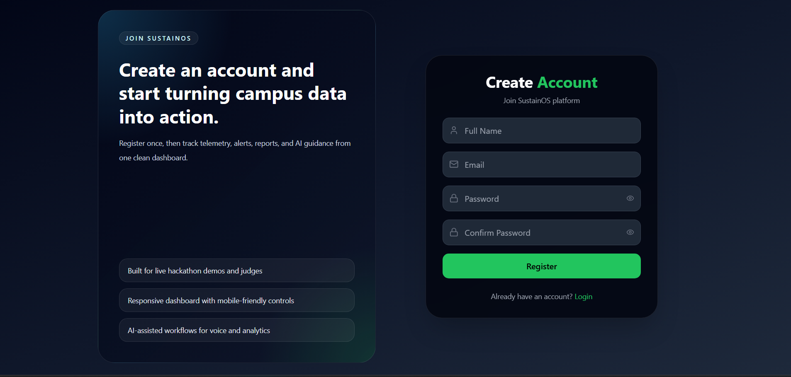 | 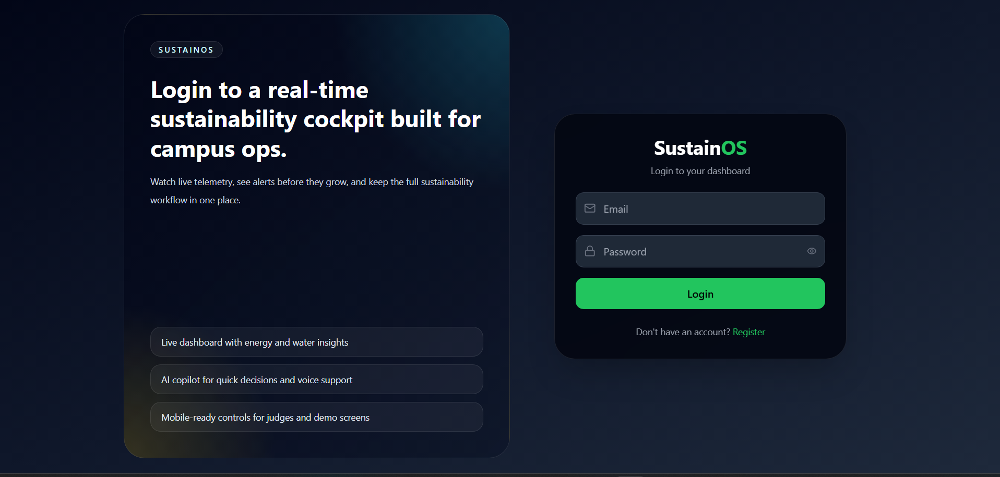 |

| Dashboard | Locations |
| --- | --- |
| 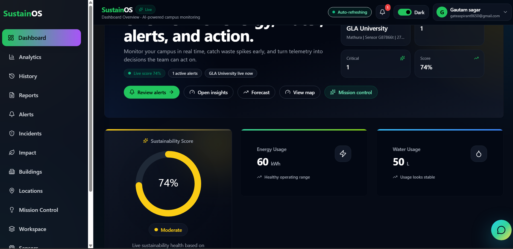 | 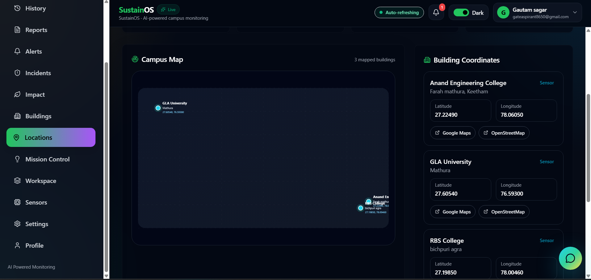 |

| Buildings | Mission Control |
| --- | --- |
| 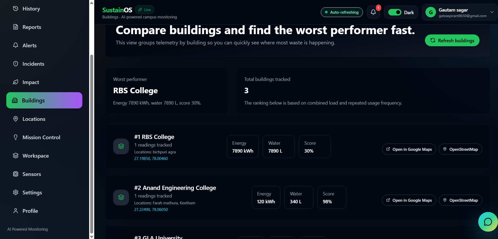 | 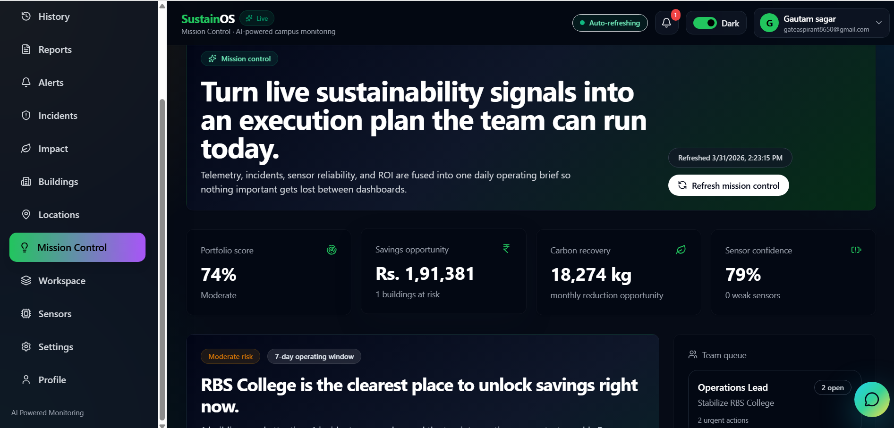 |

| Alerts | Incidents |
| --- | --- |
| 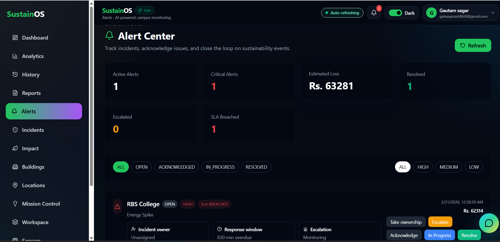 | 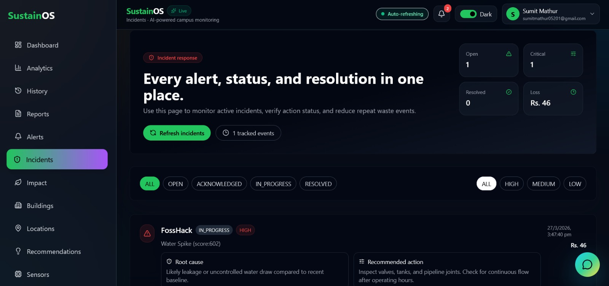 |

| Sensors | History |
| --- | --- |
| 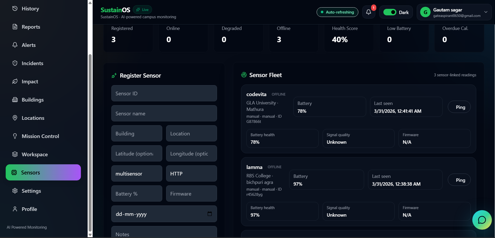 | 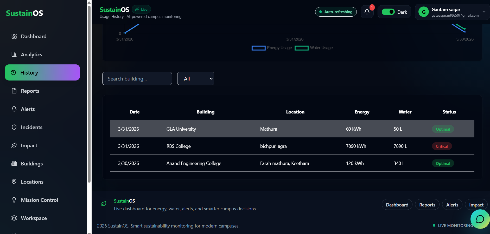 |

| Analytics | Reports |
| --- | --- |
| 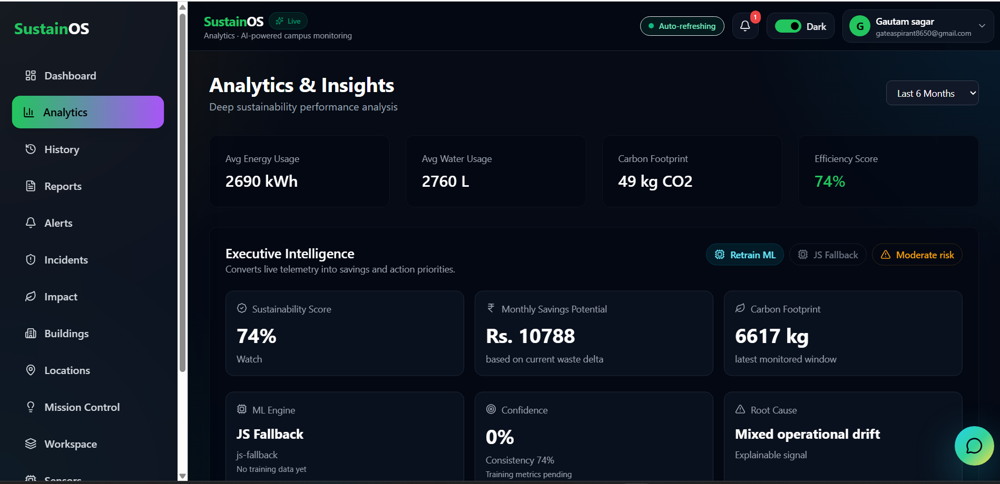 | 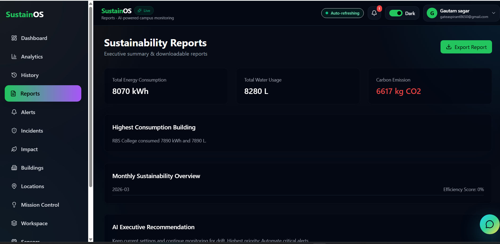 |

| Workspace | Settings |
| --- | --- |
| 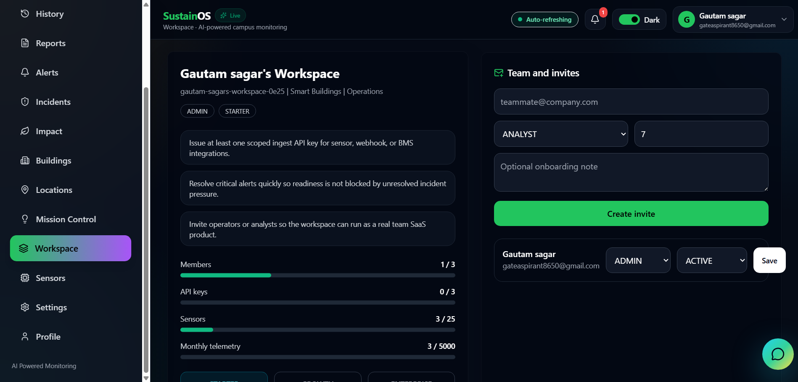 | 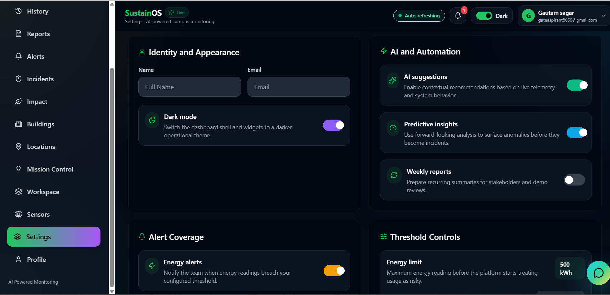 |

## Tech Stack

- Frontend: React, Vite, Tailwind CSS
- Backend: Node.js, Express, Socket.IO
- Database: MongoDB
- Forecasting service: Python
- Deployment: Render

## Project Structure

```text
Client/        React frontend
server/        Node.js backend API
ml_service/    Python forecasting service
screenshots/   App screenshots
render.yaml    Render deployment config
```

## One-Link Deployment

The public app runs from one main Render link:

https://sustainos-api.onrender.com/

Render also runs a separate Python service in the background. Users do not need to open that service directly. The frontend talks to the backend, and the backend talks to the Python service when needed.

## Local Setup

### Requirements

- Node.js 20+
- Python 3.10+
- MongoDB connection string

### Install

```powershell
cd server
npm install

cd ..\Client
npm install

cd ..\ml_service
pip install -r requirements.txt
```

### Environment Files

Use the example files as a guide:

- `server/.env.example`
- `Client/.env.example`
- `ml_service/.env.example`

Common local values:

```env
CLIENT_ORIGIN=http://localhost:5173
VITE_API_URL=http://localhost:5000
VITE_SOCKET_URL=http://localhost:5000
ML_SERVICE_URL=http://localhost:8000
```

### Run Locally

```powershell
python ml_service/server.py
```

```powershell
cd server
npm run dev
```

```powershell
cd Client
npm run dev
```

You can also use:

```powershell
.\start-dev.ps1
```

## Testing

Backend tests:

```powershell
cd server
npm test
```

Frontend build:

```powershell
cd Client
npm run build
```

Smoke test:

```powershell
.\hackathon-smoke-test.ps1 -FrontendUrl http://127.0.0.1:5173 -BackendUrl http://127.0.0.1:5000 -MlUrl http://127.0.0.1:8000
```

## Team

Built by Team ByteCoder.

Contributors:

- Gautam Sagar
- Gaurav Gautam
- Manjeet Varun
- Sumit Mathur

## License

This project is licensed under the MIT License. See [LICENSE](LICENSE).
